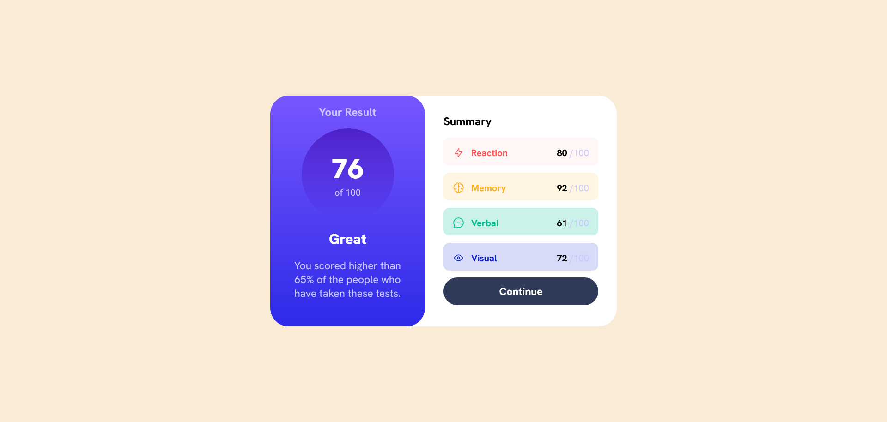
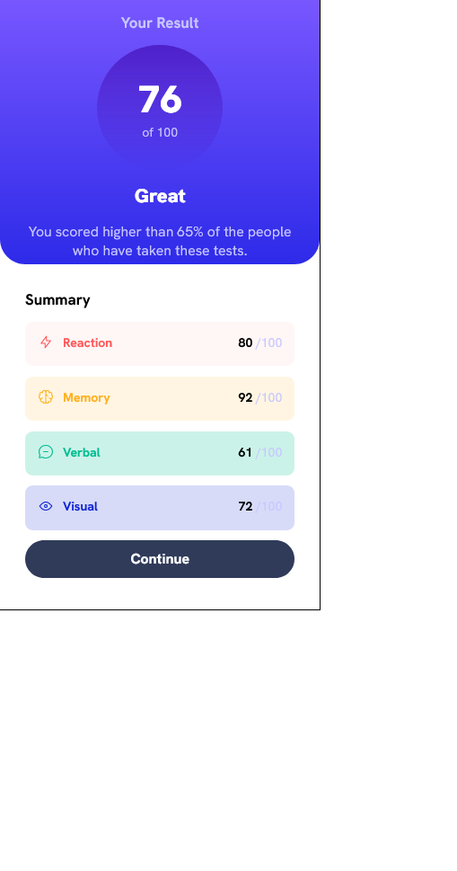

# Frontend Mentor - Results summary component solution

This is a solution to the [Results summary component challenge on Frontend Mentor](https://www.frontendmentor.io/challenges/results-summary-component-CE_K6s0maV). Frontend Mentor challenges help you improve your coding skills by building realistic projects. 

## Table of contents

- [Overview](#overview)
  - [The challenge](#the-challenge)
  - [Screenshot](#screenshot)
  - [Links](#links)
- [My process](#my-process)
  - [Built with](#built-with)
  - [What I learned](#what-i-learned)
- [Author](#author)


## Overview

### The challenge

Users should be able to:

- View the optimal layout for the interface depending on their device's screen size
- See hover and focus states for all interactive elements on the page

### Screenshot





### Links

- Live Site URL: [Add live site URL here](https://your-live-site-url.com)

## My process

### Built with

- Semantic HTML5 markup
- CSS custom properties
- Flexbox
- CSS Grid


### What I learned

Use this section to recap over some of your major learnings while working through this project. Writing these out and providing code samples of areas you want to highlight is a great way to reinforce your own knowledge.

To see how you can add code snippets, see below:

```html
<!DOCTYPE html>
<html lang="en">
<head>
  <meta charset="UTF-8">
  <meta name="viewport" content="width=device-width, initial-scale=1.0"> <!-- displays site properly based on user's device -->

  <link rel="icon" type="image/png" sizes="32x32" href="./assets/images/favicon-32x32.png">
  
  <link rel="stylesheet" href="style.css" />
  <title>Frontend Mentor | Results summary component</title>
  <script src="script.js"></script>
 
</head>
<body>
  <main>
    <section id="result-section">
      <div id="yourResult">Your Result</div>
      <div id="pasentage-box">
        <div id="pasentage-circle">
          <span id="pasentage">76</span>
          of 100
        </div>
      </div>
      <div id="result-output-text">
        Great
      </div>
      <p id="other-text">
        You scored higher than 65% of the people who have taken these tests.
      </p>
    </section>
    <section id="summary-section">
      <div id="summary-header">
        Summary
      </div>
      <div id="summary-list">
        <!-- <div class="item">
          <div class="svg">
            <svg xmlns="http://www.w3.org/2000/svg" width="20" height="20" fill="none" viewBox="0 0 20 20"><path stroke="#F55" stroke-linecap="round" stroke-linejoin="round" stroke-width="1.25" d="M10.833 8.333V2.5l-6.666 9.167h5V17.5l6.666-9.167h-5Z"/></svg>
          </div>
          <div class="category">
            Reaction
          </div>
          <div class="summary-pasentage">
            <span>80</span>
            / 100
          </div>
        </div> -->
        
      </div>
      <button id="continue-btn">Continue</button>
    </section>
  </main>

</body>
</html>
```
```css
@font-face {
    font-family: HankenGrotesk;
    src: url(./assets/fonts/HankenGrotesk-VariableFont_wght.ttf);
}

@font-face {
    font-family: HankenGrotesk-Bold;
    src: url(./assets/fonts/static/HankenGrotesk-Bold.ttf);
}

@font-face {
    font-family: HankenGrotesk-ExtraBold;
    src: url(./assets/fonts/static/HankenGrotesk-ExtraBold.ttf);
}

@font-face {
    font-family: HankenGrotesk-Medium;
    src: url(./assets/fonts/static/HankenGrotesk-Medium.ttf);
}

body {
    margin: 0;
    padding: 0;
    height: 100vh;
}

* {
    font-family: HankenGrotesk;

}

main {
    height: 100%;
    /* background-color: hsl(0, 0%, 100%); */
}

#result-section {
    background-image: linear-gradient(hsl(252, 100%, 67%), hsl(241, 81%, 54%));
    height: 40%;
    min-height: 21rem;
    border-radius: 0 0 2rem 2rem;

}

#yourResult {
    font-family: HankenGrotesk-Bold ;
    color: hsl(241, 100%, 89%);
    font-size: 1.2rem;
    padding: 1rem;
    text-align: center;
}

#pasentage-box {
    display: flex;
    justify-content: center;
    align-items: center;
    width: 100%;
}

#pasentage-circle {
    background-image: linear-gradient(hsla(256, 72%, 46%, 1), hsla(241, 72%, 46%, 0));
    border-radius: 100%;
    display: flex;
    flex-direction: column;
    text-align: center;
    justify-content: center;
    align-items: center;
    color: hsl(241, 100%, 89%);
    height: 10rem;
    width: 10rem;
    font-size: 1rem;
}

#pasentage {
    font-size: 3rem;
    font-weight: 800;
    color: hsl(0, 0%, 100%);
    font-family: HankenGrotesk-ExtraBold;
}

#result-output-text {
    color: hsl(0, 0%, 100%);
    font-size: 1.5rem;
    margin: 1rem 0rem;
    text-align: center;
    font-weight: 700;
    font-family: HankenGrotesk-Bold;
}

#other-text {
    text-align: center;
    color: hsl(241, 100%, 89%);
    font-size: 18px;
    padding: 0 2rem;
}

#summary-section {
    margin: 2rem;
}

#summary-header {
    font-family: HankenGrotesk-Bold;
    font-size: 1.2rem;
    padding: 0 0 1rem 0;

}

#summary-list {
    width: 100%;
    display: flex;
    flex-direction: column;
    row-gap: 0.8rem;
    margin-bottom: 12px;
}

.item {
    display: flex;
    /* background-color: hsla(0, 100%, 67%, 0.052); */
    padding: 1rem;
    border-radius: 10px;
}

.svg {
    width: initial;
    margin: 0 12px 0 0;
}

.category {
    font-family: HankenGrotesk-Bold;
    flex: 1;
    color: hsl(0, 100%, 67%);

}

.summary-pasentage {
    color: hsl(241, 100%, 89%);

}

.summary-pasentage>span {
    font-family: HankenGrotesk-Bold;
    color: black;

}

#continue-btn {
    width: 100%;
    height: 3rem;
    border-radius: 25px;
    border: 0px;
    background-color: hsl(224, 30%, 27%);
    font-family: HankenGrotesk-ExtraBold;
    font-size: 18px;
    color: hsl(0, 0%, 100%);
}
#continue-btn:hover{
    background-color: hsl(241, 81%, 54%);
}

.item1 {
    background-color: hsla(0, 100%, 67%, 0.052);

}


.item2 {
    background-color: hsla(39, 100%, 56%, 0.125);

}

.item3 {
    background-color: hsla(166, 100%, 37%, 0.205);

}

.item4 {
    background-color: hsla(234, 85%, 45%, 0.166);

}

@media only screen and (min-width: 700px) {
    body{
        margin:  auto 0;
        display: grid;
        place-items:center ;

        background-color: antiquewhite;
    }
    main {
        background-color: hsl(0, 0%, 100%);
        width: 600px;
        display: flex;
        height: 400px;
        border-radius: 2rem 2rem ;

    }

    #result-section {
        width: 50%;
        height: 450px;
        height: 100%;
        border-radius: 2rem 2rem ;


    }
    #summary-section{
        height: 100%;
        margin-bottom: 3rem;
        width: 50%;
    }
    .item{
        height: 1.0rem;
    }

  }
```
```js

async function addItem(){
    const data = await fetch('./data.json');
    const res = await data.json();
    // console.log(res);
    const category = {
        "Reaction" : {
            "BackGroundColor" : "hsla(0, 100%, 67%, 0.052)",
            "TextColor" :   "hsl(0, 100%, 67%)"
        },
        "Memory" : {
            "BackGroundColor" : "hsla(39, 100%, 56%, 0.125)",
            "TextColor" :   "hsl(39, 100%, 56%)"
        },
        "Verbal" : {
            "BackGroundColor" : "hsla(166, 100%, 37%, 0.205)",
            "TextColor" :   "hsl(166, 100%, 37%)"
        },
        "Visual" : {
            "BackGroundColor" : "hsla(234, 85%, 45%, 0.166)",
            "TextColor" :   "hsl(234, 85%, 45%)"
        }
    }

    for (item of res){
        console.log(item);

        const summaryListEle = document.getElementById('summary-list');
        const itemElement = document.createElement('div');
        const svgElement = document.createElement('div');
        const imgElement = document.createElement('img');
        const categoryElement = document.createElement('div');

        const summaryPasentageEle = document.createElement('div');
        const spanElement = document.createElement('span');

        itemElement.classList = 'item'
        itemElement.style.backgroundColor = category[item.category].BackGroundColor;
        svgElement.className = 'svg';
        imgElement.alt = "img";
        categoryElement.className = "category";
        categoryElement.style.color = category[item.category].TextColor;
        summaryPasentageEle.className = "summary-pasentage";


        imgElement.src = item.icon;
        
        svgElement.appendChild(imgElement);

        categoryElement.innerText = item.category;
        spanElement.innerText = item.score;
        summaryPasentageEle.appendChild(spanElement);
        summaryPasentageEle.append(" /100")
        itemElement.appendChild(svgElement);
        itemElement.appendChild(categoryElement);
        itemElement.appendChild(summaryPasentageEle);


        summaryListEle.appendChild(itemElement);

    }
}

addItem();
```

If you want more help with writing markdown, we'd recommend checking out [The Markdown Guide](https://www.markdownguide.org/) to learn more.


## Author

- Website - [Add your name here](https://www.your-site.com)
- Frontend Mentor - [@sayyedaaman2](https://www.frontendmentor.io/profile/sayyedaaman2)
- Twitter - [@SayyedAaman](https://www.twitter.com/SayyedAaman)


